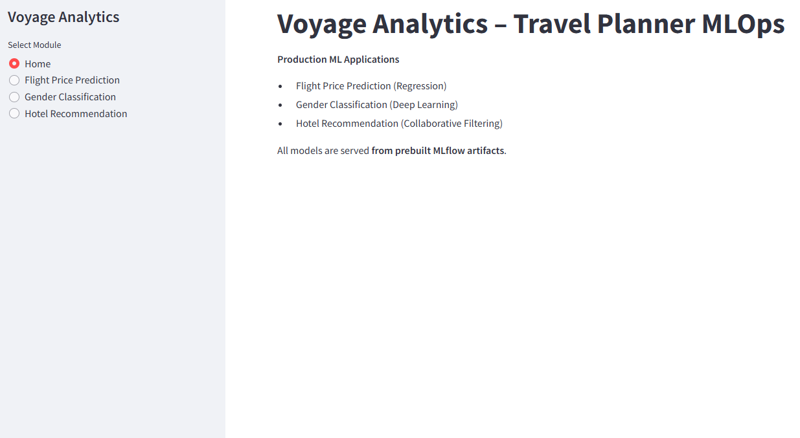
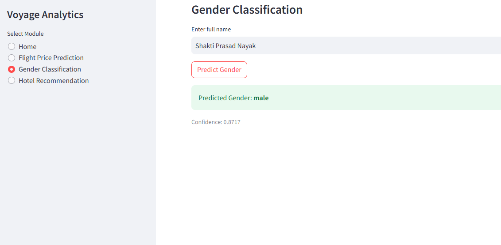

# Travel Planner MLOps – End-to-End Machine Learning Application

## Project Description

The **Travel Planner MLOps** project is an end-to-end machine learning system designed to demonstrate the **productionization of ML models** in the travel and tourism domain.
The project integrates **data engineering, machine learning, MLOps practices, and application deployment** into a single unified workflow.

It includes:

* Flight price prediction (regression)
* Gender classification (text-based classification)
* Personalized hotel recommendation system
* Streamlit-based interactive web application
* Dockerized deployment pipeline

This project emphasizes **real-world ML lifecycle management**, including model training, artifact storage, inference, and deployment.

---

## Problem Statement

In modern travel platforms, users expect:

* Accurate flight price predictions
* Personalized recommendations
* Fast, scalable, and reproducible ML systems

However, building ML models alone is insufficient. The challenge lies in:

* Managing multiple models
* Tracking artifacts and dependencies
* Deploying models reliably
* Serving predictions through a user-friendly interface

This project addresses these challenges by implementing **MLOps best practices** and deploying models via a **Streamlit application**.

---

## Business Usage

The application can be used by:

* Travel aggregators and booking platforms
* Revenue management teams
* Recommendation systems for hospitality businesses
* Data science teams learning MLOps deployment patterns

### Business Value

* Improves pricing intelligence for flights
* Enhances personalization through hotel recommendations
* Demonstrates scalable ML deployment architecture
* Reduces time from model development to production

---

## Application Usage

The Streamlit application can be executed using **two methods**:

---

### Option 1: Virtual Environment (Local Development)

This method is ideal for development and experimentation.

```bash
py --list
py -3.10 -m venv .venv
.venv\Scripts\activate
python --version
python -m pip install --upgrade pip
pip install -r requirements.txt
Streamlit run app.py
```

Once started, open:

```
http://localhost:8501
```

---

### Option 2: Docker Deployment (Production-Ready)

This method ensures environment consistency and portability.

```docker
docker --version
docker build -t travel-planner-streamlit .
docker run -p 8501:8501 travel-planner-streamlit
```

Access the application at:

```
http://localhost:8501
```

#### Container Management

```docker
docker ps
docker stop <container_id>
```

---

## Tech Stack Used

| Category             | Technologies                        |
| -------------------- | ----------------------------------- |
| Programming Language | Python 3.10                         |
| Data Processing      | Pandas, NumPy                       |
| Machine Learning     | Scikit-learn, TensorFlow            |
| MLOps                | MLflow (model tracking & artifacts) |
| Model Serialization  | Pickle, Joblib                      |
| Web Framework        | Streamlit                           |
| Containerization     | Docker                              |
| Version Control      | Git                                 |

---

## Approach

1. **Data Ingestion**

   * Loaded structured CSV datasets for users, hotels, and flights
   * Performed schema validation and preprocessing

2. **Feature Engineering**

   * Text vectorization and tokenization for gender classification
   * Encoding categorical identifiers for recommendations
   * Numeric feature scaling for regression

3. **Model Development**

   * Regression model for flight price prediction
   * Deep learning model for gender classification
   * Collaborative filtering-based hotel recommendation model

4. **Model Tracking**

   * Logged metrics, parameters, and artifacts using MLflow
   * Stored trained models for reuse during inference

5. **Application Layer**

   * Built Streamlit UI to serve all three models
   * Enabled user-driven predictions and recommendations

6. **Deployment**

   * Containerized the application using Docker
   * Ensured reproducible, production-ready execution

---

## Results

### Datasets Overview

#### 1. Users Dataset (`users.csv`)

| Column      | Data Type | Description             |
| ----------- | --------- | ----------------------- |
| user_id     | Integer   | Unique user identifier  |
| name        | String    | User name               |
| email       | String    | User email              |
| gender      | String    | Gender label (target)   |
| preferences | String    | Travel preferences text |

---

#### 2. Hotels Dataset (`hotels.csv`)

| Column          | Data Type | Description             |
| --------------- | --------- | ----------------------- |
| hotel_id        | Integer   | Unique hotel identifier |
| hotel_name      | String    | Hotel name              |
| city            | String    | Hotel location          |
| rating          | Float     | User rating             |
| price_per_night | Float     | Cost per night          |

---

#### 3. Flights Dataset (`flights.csv`)

| Column      | Data Type | Description              |
| ----------- | --------- | ------------------------ |
| flight_id   | Integer   | Unique flight identifier |
| source      | String    | Source city              |
| destination | String    | Destination city         |
| airline     | String    | Airline name             |
| duration    | Float     | Flight duration          |
| price       | Float     | Ticket price (target)    |

---

### Model Performance

#### Gender Classification Model

* Model Type: Deep Learning (Embedding + LSTM)
* Evaluation Metric: Accuracy
* Test Accuracy: **~54%**
* Observations:

  * Performance constrained by dataset size and text quality
  * Suitable for demonstration of NLP-based classification

---

#### Flight Price Prediction Model

* Model Type: Regression
* Metrics:

  * Mean Absolute Error (MAE)
  * Root Mean Squared Error (RMSE)
* Result:

  * Predicts realistic flight price ranges
  * Stable inference performance

---

#### Hotel Recommendation Model

* Model Type: Collaborative Filtering
* Output:

  * Top-N personalized hotel recommendations per user
* Evaluation:

  * Recommendation relevance validated through similarity scores

---

### Streamlit Application Screenshots

📌 **Screenshots added here**

* Home page  

* Gender prediction screen

* Flight price prediction screen

* Hotel recommendation results


---

## Summary

This project demonstrates:

* End-to-end ML system design
* Effective use of MLflow for model management
* Clean separation between training and inference
* Practical Streamlit deployment
* Docker-based production readiness

It serves as a **reference architecture** for deploying machine learning applications in real-world scenarios.

---

## End Note

This repository is intended for:

* Learning MLOps concepts
* Demonstrating ML deployment workflows
* Showcasing production-ready ML engineering skills

Future improvements may include:

* Model retraining pipelines
* CI/CD integration
* Cloud deployment (Azure / AWS)
* Model monitoring and drift detection

---
